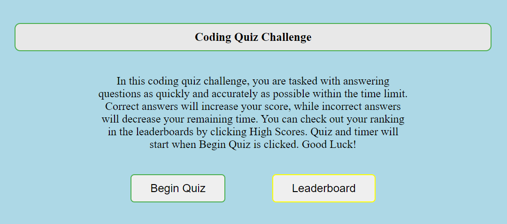

# JS-Coding-Quiz
JavaScript Coding Quiz

## Description
This is a quiz API createcd with minimal HTML and CSS utilizing JavaScript to change elements dynamically. The subject of the quiz is coding and contains multiple choice questions. The user is timed during the quiz, each question answered incorrectly decreases the time by 10 seconds. Each correct answer is rewarded with points. At the end of the quiz the user is prompted for their name to submit their score to a High Scores page. User's names and scores are stored locally will populate any stored High Scores upon accessing the leaderboard page.

## Usage
#### Home page
Displays instructions regarding the quiz and a brief explanation of functionality. There are two buttons, Begin Quiz, and Leaderboard. 

#### Quizzing
Begin Quiz will start the timer and begin the quiz loop. This loop is breaks when the timer reaches 0 or the user answers all questions. Questions and Answers are stored in arrays and are called based on the question number the user is on. When the user selects an answer it is graded against the correct answer via switch case. If correct, score is added, and if incorrect, time is reduced.

#### Score Submission
When the test is over, either timer reaching 0 or user answering all questions, the user's score is displayed with a input field to enter their name. Once submitted the user's name and score are saved to local storage in an object.

#### Leaderboard
After score submission the user is taken to the leaderboard screen. This can also be accessed through the home screen via the leaderboard button. If there are any scores saved in local storage it will pull them and display them in order of highest to lowest.

## Credits
All questions for this quiz were borrowed from Solo Learn's JavaScript course
https://www.sololearn.com/Course/JavaScript/

The `sortScores()` function was created with the aid of a post on Stack Overflow reagrding sorting `
` elements with only JavaScript. This helped me store children of an element into a variable then transform it into an array that could then be sorted via the `sort()` method

https://stackoverflow.com/a/5067017/13803137

## License
MIT License

Copyright (c) [year] [fullname]

Permission is hereby granted, free of charge, to any person obtaining a copy
of this software and associated documentation files (the "Software"), to deal
in the Software without restriction, including without limitation the rights
to use, copy, modify, merge, publish, distribute, sublicense, and/or sell
copies of the Software, and to permit persons to whom the Software is
furnished to do so, subject to the following conditions:

The above copyright notice and this permission notice shall be included in all
copies or substantial portions of the Software.

THE SOFTWARE IS PROVIDED "AS IS", WITHOUT WARRANTY OF ANY KIND, EXPRESS OR
IMPLIED, INCLUDING BUT NOT LIMITED TO THE WARRANTIES OF MERCHANTABILITY,
FITNESS FOR A PARTICULAR PURPOSE AND NONINFRINGEMENT. IN NO EVENT SHALL THE
AUTHORS OR COPYRIGHT HOLDERS BE LIABLE FOR ANY CLAIM, DAMAGES OR OTHER
LIABILITY, WHETHER IN AN ACTION OF CONTRACT, TORT OR OTHERWISE, ARISING FROM,
OUT OF OR IN CONNECTION WITH THE SOFTWARE OR THE USE OR OTHER DEALINGS IN THE
SOFTWARE.